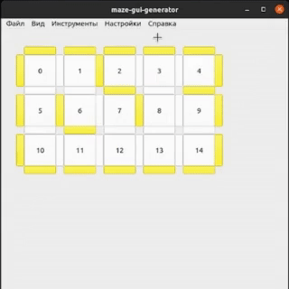

# maze-gui-gen

**А вы сможете создать упражнение для TRIK Studio за 30 секунд?**

Я создал кроссплатформенное приложение, которое может помочь учителям и ученикам, которые работают с симулятором TRIK Studio, сгенерировать поля программно, вместо того, чтобы вручную изменять (.xml) файл.

**Что для этого нужно?**

* Скачайте программу
* Создайте карту с размером, который вам нужен (Инструменты - Создать карту)


* Самостоятельно выбирите куда поставить "стенки" или сгенерируете случайно (Инструменты - Случайно расставить стенки)


* Нажмите один раз на любую клетку, чтобы сделать её стартовой, дважды, чтобы указать на финиш. 



* Чтобы сохранить карту с лабиринтом выбирите (Инструменты - Экспортировать поле с лабиринтом), для лабиринта в виде линий (Инструменты - Экспортировать поле с линиями) 


* Откройте TRIK Studio и загружаете свою модель мира.
* Круто, теперь вы создали упражнение.

## Интерфейс maze-gui-gen


Главное меню **maze-gui-gen** содержит набор базовых операций и настроек.

* **Файл**
* **Вид**
* **Инструменты**
* **Настройки**
* **Справка**

# Файл


1. **Сохранить матрицу смежности** - возможность сохранить карту лабиринта (.txt) в двух форматах: матрица смежности, массив из N (вершин) массивов на 4 элемента, указывающий на связь с верхней, правой, нижней и левой вершиной.

1. **Сохранить поле с лабиринтом** - возможность сгенерировать и сохранить поле формата (.xml) с лабиринтом со стенками.

1. **Сохранить поле с линиями** - возможность сгенерировать и сохранить поле формата (.xml) с лабиринтом из линий.

# Вид


Панель "Вид" содержит кнопки, позволяющие изменить масштаб карты. (Приблизить / Отдалить)

Также масштабировать карту можно с помощью:
  1. Вращения колесика мыши
  1. Сочетания клавиш ```Ctrl+=``` и ```Ctrl+-```

# Инструменты


1. **Создать карту** - возможность специально указать нужный размер карты ```Сочетание клавиш Ctrl+N```

1. **Случайно расставить стенки** - рандомно расставляет стенки в карту с текущими размерами ```Сочетание клавиш Ctrl+R```

1. **Заполнить карту стенками** - полностью заполняет текущую карту стенками ```Сочетание Ctrl+F```

# Настройки


Панель "Настройки" содержит кнопки, позволяющие открыть окно Настроек или выбрать язык.

Также открыть окно Настроек можно с помощью сочетания клавиш ```Ctrl+Shift+S```.

# Справка


1. **Помощь** - возможность открыть справку. ```Сочетание клавиш F1```

1. **О программе** - просмотреть краткую информацию о **maze-gui-gen**.

## Настройки maze-gui-gen


## Настройки для генерации полей

* **Лабинт с циклами** - при наличие циклов в лабиринте количество путей между двумя разными ячейками может быть больше одного.

* **Размер ячейки с линией** - количество клеток TRIK Studio, занимаемых одной ячейкой для поля с линиями.

* **Ширина линии** - значение в пикселях для поля с линиями

* **Размер ячейки для лабиринта** - количество клеток TRIK Studio, занимаемых одной ячейкой для поля со стенками.

* **Временное ограничение для задания** - после истечения времени задание закончится автоматически. Формат - (MM:SS).

* **Цвет линии** - возможность выбрать цвет линии при генерации поля.

* **Применить изменения** - возможность сохранить и применить маши настройки.