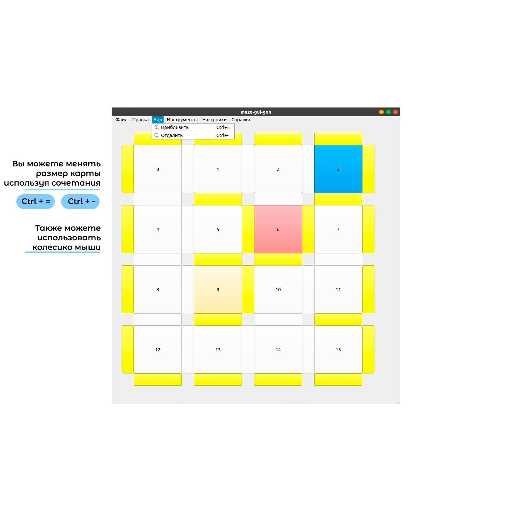

# maze-gui-gen

**А вы сможете создать упражнение для TRIK Studio за 30 секунд?**

Я создал кроссплатформенное приложение, которое может помочь учителям и ученикам, которые работают с симулятором TRIK Studio, сгенерировать поля программно, вместо того, чтобы вручную изменять (.xml) файл.

**Что для этого нужно?**

* Скачайте программу
* Создайте карту с размером, который вам нужен (Инструменты - Создать карту)

<details><summary>Пример</summary>
<p>

</p>
</details>

* Самостоятельно выберите куда поставить "стенки" или сгенерируете случайно (Инструменты - Случайно расставить стенки)

<details><summary>Пример</summary>
<p>

</p>
</details>

* Нажмите один раз на любую клетку, чтобы сделать её стартовой, дважды, чтобы указать на финиш. 

<details><summary>Пример</summary>
<p>

</p>
</details>

* Чтобы сохранить карту с лабиринтом выберите (Инструменты - Экспортировать поле с лабиринтом), для лабиринта в виде линий (Инструменты - Экспортировать поле с линиями) 

<details><summary>Пример</summary>
<p>

</p>
</details>

* Откройте TRIK Studio и загрузите свою модель мира.
* Круто, теперь вы создали упражнение.

## Интерфейс maze-gui-gen


**maze-gui-gen** имеет следующие элементы интерфейса:

* [Панель "Файл"](#файл)
* [Панель "Правка"](#правка)
* [Панель "Вид"](#вид)
* [Панель "Инструменты"](#инструменты)
* [Панель "Настройки"](#настройки)
* [Панель "Справка"](#справка)

# Файл


1. **Сохранить матрицу смежности** - возможность сохранить карту лабиринта (.txt) в двух форматах: матрица смежности, массив из N (вершин) массивов на 4 элемента, указывающий на связь с верхней, правой, нижней и левой вершиной.

1. **Сохранить поле с лабиринтом** - возможность сгенерировать и сохранить поле формата (.xml) с лабиринтом со стенками.

1. **Сохранить поле с линиями** - возможность сгенерировать и сохранить поле формата (.xml) с лабиринтом из линий.

# Правка


1. **Отменить** - возможность вернуться к состоянию карты до вашего последнего изменения  
```Сочетание клавиш Ctrl+Z```
1. **Повторить** - возможность отменить отмену последнего изменения  
```Сочетание клавиш Ctrl+Shift+Z```

При создании новой карты история изменений обнуляется

# Вид


Панель "Вид" содержит кнопки, позволяющие изменить масштаб карты. (Приблизить / Отдалить)

Также масштабировать карту можно с помощью:
1. Сочетания клавиш ```Ctrl+=``` и ```Ctrl+-```
1. Вращения колесика мыши

# Инструменты


1. **Создать карту** - возможность специально указать нужный размер карты  
```Сочетание клавиш Ctrl+N```

1. **Случайно расставить стенки** - рандомно расставляет стенки в карту с текущими размерами  
```Сочетание клавиш Ctrl+R```

1. **Заполнить карту стенками** - полностью заполняет текущую карту стенками  
```Сочетание Ctrl+F```

# Настройки


Панель "Настройки" содержит кнопки, позволяющие открыть [окно Настроек](#настройки-maze-gui-gen) или выбрать язык.

Также открыть окно Настроек можно с помощью сочетания клавиш  
```Ctrl+Shift+S```.

# Справка


1. **Помощь** - возможность открыть справку.  
```Сочетание клавиш F1```

1. **О программе** - просмотреть краткую информацию о **maze-gui-gen**.

## Настройки maze-gui-gen

Окно настроек **maze-gui-gen** открывается выбором соответствующего пункта в [главном меню](#настройки)


## Настройки для генерации полей

* **Сохранять PNG превью для полей** - при создании **любого** нового поля, в той же папке будет сохраняться png картинка, на которой будет отображен тип поля, его разметка, робототехнический конструктор, который использовался при генерации.
вставить пример

* **Сохранять SVG файл для полей** - при создании поля с **лабиринтом с линиями**, в той же папке будет сохраняться SVG поле, которое можно открыть в симуляторе в качестве картинки.

* **Лабинт с циклами** - при наличие циклов в лабиринте количество путей между двумя разными ячейками может быть больше одного.

* **Платформа** - робототехнический конструктор, который будет "подставляться" в сгенерированное поле. Сейчас доступно три варианта: **TRIK**, **Lego EV3**, **XML**. 
В варианте **XML** вы можете открыть поле с роботом с нужной вам конфигурацией. Тогда уже готовая конфигурация робота будет добавляться в XML поля.

* **Размер ячейки с линией** - количество клеток TRIK Studio, занимаемых одной ячейкой для поля с линиями.

* **Ширина линии** - значение в пикселях для поля с линиями

* **Размер ячейки для лабиринта** - количество клеток TRIK Studio, занимаемых одной ячейкой для поля со стенками.

* **Временное ограничение для задания** - после истечения времени задание закончится автоматически. Формат - (MM:SS).

* **Цвет линии** - возможность выбрать цвет линии при генерации поля.

* **Применить изменения** - возможность сохранить и применить маши настройки.
